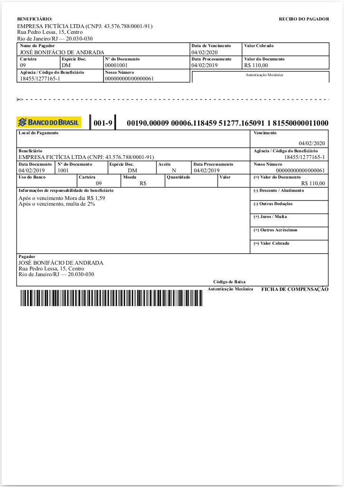
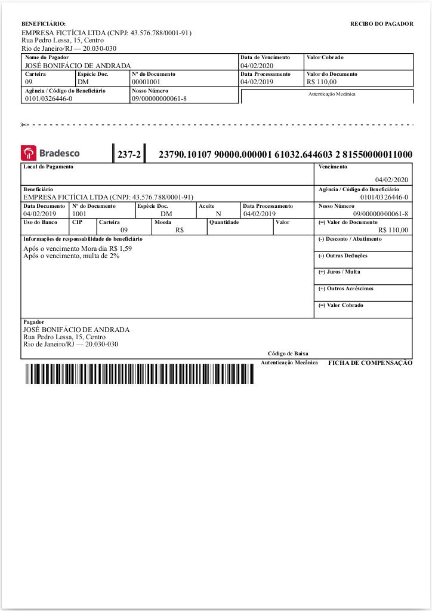
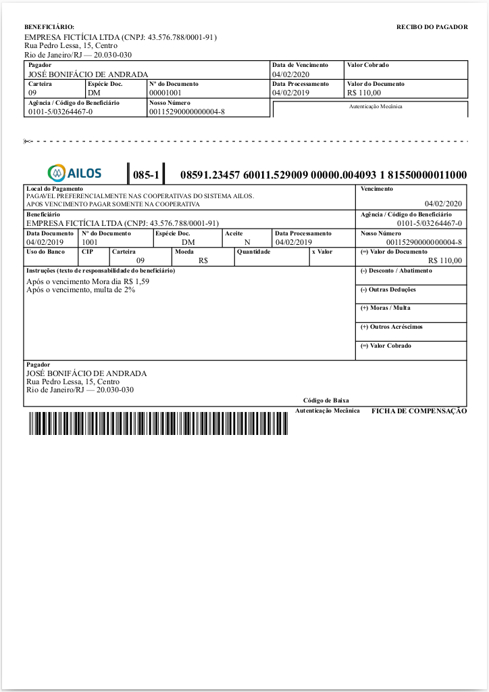

# EasyBoleto

Biblioteca em Node.js para geração de boletos utilizando PDFKit.

## Geração de boletos para bancos:

- Bradesco
- Caixa
- Ailos (Cecred)
- Itaú
- Sicoob
- Sicredi
- Santander
- Banco do Brasil

## Instalação

```bash
npm i easy-boleto
```

## Exemplos de uso

### Gerar Boleto Brasil

```bash
npm run gerarBrasil
```



### Gerar Boleto Bradesco

```bash
npm run gerarBradesco
```



### Gerar Boleto Cecred

```bash
npm run gerarCecred
```



- [Pasta com arquivos de exemplo](/examples)

## Licença

Este projeto está licenciado sob a licença MIT. Veja o arquivo [LICENSE](./LICENSE) para mais detalhes.
